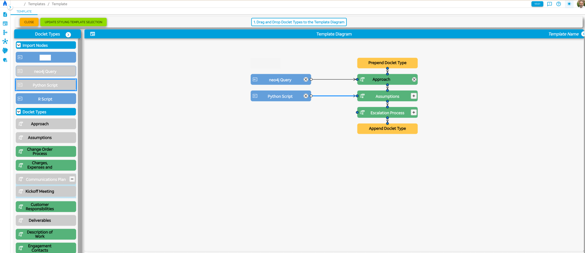
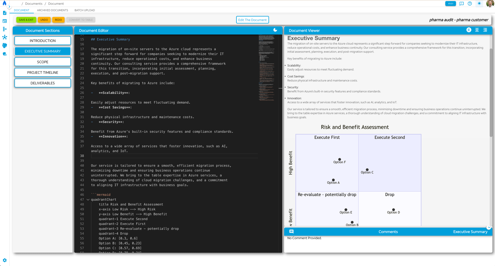
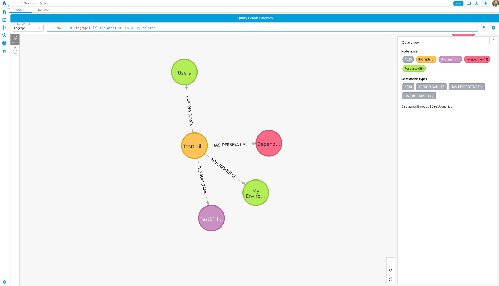

## Overview

Architect, Product Manager, and Co-developer of a Knowledge Management Repository that leverages AI Language Model technology to assist in automating the creation of new assets based partly on the re-use of existing documents from the repository.

## Exhibited Skills

- Complex Software Application Architecture, Design, and Development
- Agile Sprint Product Owner and Lead Developer roles
- Agile Project Management using Azure DevOps
- Language Models related technologies and techniques, including LangChain, LangGraph, OpenAI API, Retrieval Augmented Generation (RAG) and Graph RAG techniques
- Typescript, Python Programming languages
- Neo4j Graph Database, including schema design, Cypher query language, GraphQL & AOC libraries, integration of browser visualization tool
- Software libraries, frameworks, and tools including 'React', 'Node.js', 'GraphQL', 'NestJS', 'gRPC'
- Virtualization technologies including Docker, Kubernetes, Azure Kubernetes Service (AKS)

## Details

I proposed and gained funding for a smart knowledge management repository tool for use within a consulting organization. The tool would leverage Language Models (LM) technology to assist in automating the creation of new assets based partly on the re-use of existing documents from the repository. The tool would also provide a mechanism for the organization to capture and store knowledge from its consultants and their work product in a structured and searchable manner. The tool would be used to create new assets such as proposals, statements of work, audit reports, data architecture documentation, device configurations, detailed migration and implementation plans and other engagement work product and deliverables.

I led a team of developers to design and develop the tool. I also acted as the Product Owner for the project, working with the business stakeholders to define the requirements and prioritize the work. I used Agile project management techniques to manage the project, including the use of Azure DevOps for sprint planning, tracking, and reporting.

The tool is designed to be a web-based application, with a React front-end and a Node.js back-end. The back-end uses Azure Blob Storage to store asset contents, and a Neo4j graph database to store the knowledge asset metadata and their relationships. A middleware server responds to client requests and executes business logic leveraging the datastore, database, and LLM APIs. The front-end uses GraphQL to communicate with the middleware server. The tool is architected to be extensible, with the ability to add new types of assets and relationships as needed.

The tool is deployed in a Kubernetes cluster in Azure, using Azure Kubernetes Service (AKS). The tool is designed to be scalable and fault-tolerant, with multiple instances of the front-end and middleware servers running in the cluster.

## UI Screenshots

### Asset Template Builder

The tool allows users with appropriate roles to design document templates using a drag-and-drop interface. The templates can include placeholders for dynamic content that will be filled in when the document is generated. Content can be sourced from the KM datastore, or via scripts such as Cypher, Python, or R that can query other sources. This is a screen capture of the template builder interface.

    

### New Document Builder

The tool allows users with appropriate roles to create new documents based on the available templates. The tool uses Language Models to suggest content based on the document type and information provided by the user, and to integrate content across multiple sources. This is a screen capture of the new document builder editor which is based on the Monaco editor.

    

### Database Viewer

The tool includes an integration of the neo4j browser tool to allow users to explore the graph database that stores the knowledge assets and their relationships. This is a screen capture of the database viewer interface.

    

<!-- Modal Structure -->

    &times;
    

